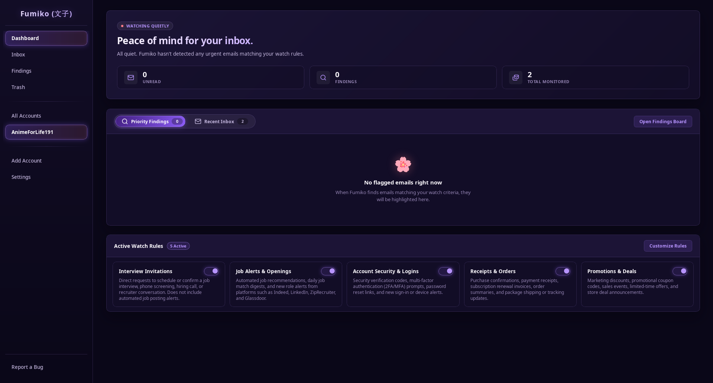

<div align="center">

# Fumiko (文子)
### A private, local-first inbox watcher powered by on-device AI

[](https://opensource.org/licenses/MPL-2.0)
[](https://www.rust-lang.org/)
[](https://dioxuslabs.com/)
[](https://sqlite.org/)
[](https://github.com/AnimeForLife191/Fumiko)
[](#)

[Website](https://animeforlife191.github.io/fumiko.html) • [Documentation](https://animeforlife191.github.io/applications/fumiko/docs.html) • [Privacy Policy](https://animeforlife191.github.io/applications/fumiko/privacy.html) • [Support](https://animeforlife191.github.io/support.html) • [Discussions](https://github.com/AnimeForLife191/Fumiko/discussions)

</div>

---

**Fumiko** is a desktop email watcher that runs completely on your computer.

You give her rules for what you care about (like *"interview invitations"*, *"job alerts"*, or *"receipts & orders"*), and she monitors your inboxes in the background across **Gmail**, **Outlook**, and standard **IMAP**. When an email matches your criteria, she flags it using an on-device local AI model.

**No cloud AI reading your inbox. No telemetry. No passwords leaving your machine.**

---

<div align="center">
  
</div>

## Key Features

* **100% Private & Local**: Everything runs on your machine. None of your email text, headers, previews, or prompts are ever sent to OpenAI, Google, or remote cloud servers.
* **Zero-Setup Built-in Engine (or use Ollama)**: Includes a bundled, plug-and-play sidecar engine that downloads quantized GGUF models directly inside the app. If you already have [Ollama](https://ollama.com) running, Fumiko supports that with a single toggle too.
* **Smart Two-Tier Scanning (Keeps your PC fast)**: A lightweight 1B to 3B model scans the sender, subject, and preview snippet first during inbox sync (Tier 1). Only if an email is ambiguous does she retrieve the body for a deeper read (Tier 2), strictly capping context and token generation to prevent system lag.
* **Broad Provider Support**:
  * **OAuth 2.0 PKCE**: Connect personal Microsoft accounts or custom Google Cloud projects over loopback without exposing credentials.
  * **Universal IMAP with App Passwords**: Connect standard IMAP accounts (Gmail, iCloud, Fastmail, Yahoo, custom self-hosted mailboxes) with automated pre-flight connection verification and password whitespace formatting.
* **The Findings Board**: Instead of digging through hundreds of newsletters and promotions, rule-matching emails get triaged onto a dedicated board with confidence scoring.
* **Configurable Storage & Retention**: Choose how many emails to store and display locally. Older messages beyond your threshold are automatically pruned in the background to keep SQLite fast and lightweight.
* **Zero Secrets in SQLite**: Passwords and OAuth refresh tokens live exclusively in your operating system's native credential store (Windows Credential Manager, Apple Keychain, or Linux Secret Service).
* **Instant & Crash-Resistant**: Powered by Rust, connection pooling, and SQLite in WAL mode with monotonically increasing UUIDv7 indexing.
* **Sandboxed Viewing & Link Safety**: Untrusted HTML email markup is sanitized through Ammonia and isolated inside a sandboxed `<iframe>`. Links are trapped and routed safely to your system's default browser.
* **Custom Theming**: Tweak colors, surfaces, and typography at runtime by dropping a `custom.css` file into your local app data folder.

---

## Why I Built Fumiko

While looking for work, I found myself constantly stressed out. I was checking my inboxes over and over every day, terrified I’d miss an interview invite or a recruiter reaching out before it got buried under promotional noise. 

On top of that, I was juggling three different inboxes (personal, work, and university). Regular email apps let you put them all in one window, but they don't help you triage what actually matters.

I built Fumiko to take that anxiety off my plate, but also to build an open, verifiable project others could use and learn from. I'm a 22-year-old solo developer building this in my spare time, but I put a lot of care into documenting the architecture and keeping the codebase readable so anyone interested in local-first software or Rust can explore how it works.

---

## Architecture & Technical Notes

Fumiko is organized as a modular Rust workspace. If you're exploring the codebase, each crate has dedicated architecture documentation:

| Crate | What it handles | Architecture Docs |
| :--- | :--- | :--- |
| **`email_core`** | Sync lifecycle, Gmail History API, Microsoft Graph Delta queries, IMAP `UIDVALIDITY` handling, `BODY.PEEK` invariants, safe cursor advancement, and automated capacity pruning. | [Sync & Provider Notes](docs/email_core.md) |
| **`oauth`** | RFC 8252 loopback authorization code flow with PKCE, dynamic ephemeral port binding (`127.0.0.1:0`), IMAP App Password verification, and constant-time CSRF validation. | [OAuth & Auth Architecture](docs/oauth.md) |
| **`local_ai`** | Multi-backend supervisor (built-in `llama-server` on port 11435 & external Ollama on port 11434), GBNF grammar constraints, context capping, and Hugging Face GGUF streaming. | [Local AI Architecture](docs/local_ai.md) |
| **`storage`** | SQLite engine, WAL mode, `PRAGMA synchronous = NORMAL`, UUIDv7 indexing, foreign keys, capacity pruning, and OS Keyring integration via `TokenStore`. | [Storage Architecture](docs/storage.md) |
| **`security`** | Threat model, memory-only access tokens, sanitized logging, ammonia HTML cleansing, and iframe navigation trapping. | [Security Notes](docs/security.md) |
| **`app`** | Desktop frontend built with Dioxus and Tao, reactive signal hierarchy, background worker channels, supervised watchers, and in-place updates. | [UI & Desktop Notes](docs/app.md) |

---

## Getting Started

### Prerequisites

1. **Rust Toolchain**: Install [rustup](https://rustup.rs/) (Rust 1.80+ recommended).
2. **[Dioxus CLI](https://dioxuslabs.com/learn/0.7/getting_started/)**:
   ```bash
   cargo install dioxus-cli
   ```
3. **Inference Engine**:
   * **Option A (Zero-Setup Built-in)**: No prerequisites! You can download verified models (like Llama 3.2 1B or Qwen 2.5 1.5B) directly from within Fumiko's Settings tab.
   * **Option B (Ollama)**: If you prefer using an existing [Ollama](https://ollama.com) installation, ensure Ollama is running and pull your preferred model:
     ```bash
     ollama pull llama3.2:1b
     ```

### Building and Running from Source

1. Clone the repository:
   ```bash
   git clone https://github.com/AnimeForLife191/Fumiko.git
   cd Fumiko
   ```

2. *(Optional)* Configure development credentials:
   ```bash
   cp .env.example .env
   ```
   *Note: You do not need a `.env` file to run the app. You can type or paste custom Google and Microsoft developer credentials directly into in-app Settings.*

3. Run the desktop application:
   ```bash
   dx serve --platform desktop
   ```

---

## Connecting Your Accounts

Fumiko supports two primary methods to connect your mailboxes:

1. **Personal Microsoft Accounts (`@outlook.com`, `@hotmail.com`, `@live.com`)**: Connects out of the box with 1-click browser OAuth. *(Note: Work and school accounts are not supported at this time due to Microsoft Publisher Verification requirements).*
2. **Universal IMAP with App Passwords (Preferred for Gmail, iCloud, Yahoo, Fastmail, and Custom Servers)**: Connects using standard TLS IMAP and provider-generated App Passwords. Preset hosts and ports are auto-filled, and spaces in copied passwords are automatically formatted. Connecting Gmail through this method is strongly recommended to avoid 7-day token expirations.
3. **Advanced: Google Cloud OAuth 2.0**: For power users who prefer Google's REST API over IMAP, you can supply your own free Google Cloud Client ID and Secret in settings.

For step-by-step instructions on setting up your accounts, see [CREDENTIAL_SETUP.md](CREDENTIAL_SETUP.md).

---

## Custom Theming

Fumiko supports dynamic CSS injection without needing to recompile the binary. 

You can customize the interface directly from **Settings → Custom Theming**:
* **Import CSS**: Click **Import .css File** and select your `.css` file directly from the file picker.
* **Open Theme Folder**: Open the local theme directory in your system file manager with one click to edit or drop in a `custom.css` file.
* **Toggle on the fly**: Enable or disable your custom theme anytime with a single switch.

### Example Palette: "Midnight Slate" (`custom.css`)

A clean, distraction-free neutral blue and slate theme for users who prefer a classic workspace palette over the default violet and coral.

```css
:root {
    /* 1. Base Surfaces (Neutral Slate / Dark Navy) */
    --bg-primary: #0b0f17;
    --bg-secondary: #111827;
    --bg-tertiary: #1e293b;
    --bg-surface: rgba(17, 24, 39, 0.80);
    --bg-surface-raised: rgba(30, 41, 59, 0.88);
    --bg-surface-card: rgba(15, 23, 42, 0.65);
    --bg-surface-translucent: rgba(255, 255, 255, 0.05);
    --bg-hover: rgba(59, 130, 246, 0.12);

    /* 2. Text & Typography */
    --text-primary: #f8fafc;
    --text-secondary: #cbd5e1;
    --text-muted: #64748b;
    --text-on-accent: #ffffff;

    /* 3. Primary Accent (Sapphire Blue) */
    --accent-primary: #3b82f6;
    --accent-primary-bright: #60a5fa;
    --accent-primary-deep: #1d4ed8;
    --accent-primary-subtle: rgba(59, 130, 246, 0.14);
    --accent-primary-hover: rgba(59, 130, 246, 0.24);
    --accent-primary-glow: rgba(59, 130, 246, 0.38);

    /* 4. Secondary Accent (Ice / Sky Cyan) */
    --accent-secondary: #06b6d4;
    --accent-secondary-bright: #38bdf8;
    --accent-secondary-deep: #0e7490;
    --accent-secondary-subtle: rgba(6, 182, 212, 0.12);
    --accent-secondary-hover: rgba(6, 182, 212, 0.22);
    --accent-secondary-glow: rgba(56, 189, 248, 0.35);

    /* 5. Status & Utility Accents */
    --accent-success: #34d399;
    --accent-success-subtle: rgba(52, 211, 153, 0.14);
    --accent-success-glow: rgba(52, 211, 153, 0.35);

    --accent-warning: #fbbf24;
    --accent-warning-subtle: rgba(251, 191, 36, 0.14);

    --accent-danger: #ef4444;
    --accent-danger-deep: #b91c1c;
    --accent-danger-subtle: rgba(239, 68, 68, 0.14);
    --accent-danger-glow: rgba(239, 68, 68, 0.38);

    /* 6. Borders & Outlines */
    --border-subtle: rgba(96, 165, 250, 0.18);
    --border-bright: rgba(96, 165, 250, 0.45);
    --border-accent: rgba(56, 189, 248, 0.45);

    /* 7. Gradients */
    --gradient-primary: linear-gradient(120deg, var(--accent-primary-deep), var(--accent-primary));
    --gradient-accent: linear-gradient(120deg, var(--accent-primary), var(--accent-secondary));
    --gradient-title: linear-gradient(135deg, var(--text-primary), var(--accent-primary-bright));
    --gradient-danger: linear-gradient(120deg, var(--accent-danger-deep), var(--accent-danger));
}
```

---

## Security & Storage Architecture

* **Zero Secrets in Database**: Passwords, refresh tokens, and OAuth secrets are stored strictly in the host OS credential vault (`keyring`). SQLite contains only non-sensitive metadata, message IDs, headers, and previews.
* **Safe Cursor Updates**: Sync cursors advance only when an entire discovered batch has been successfully hydrated and stored, preventing dropped network packets from permanently skipping unread mail.
* **Preserving Unread Mail**: IMAP message samples and body fetches strictly use `BODY.PEEK` instead of `BODY[]`, ensuring that background AI evaluations never mark unread emails as read on your server.
* **Controlled AI Resource Budget**: Context lengths are capped to 2,048 tokens (`-c 2048`), output generation is bounded to 128 tokens, and single-slot execution is enforced to prevent RAM bloat and swap thrashing.
* **Ephemeral Memory Tokens**: Access tokens remain strictly in RAM with a 50-minute proactive time-to-live and are never logged or persisted.
* **Complete One-Click Wipe**: The "Wipe All Local Data" action purges all entries from the OS Keyring, truncates SQLite tables, and runs `PRAGMA wal_checkpoint(TRUNCATE)` followed by `VACUUM` to return disk space.

---

## Part of ShuhariTech

Fumiko is the first tool I'm building under **ShuhariTech**.

The name comes from the martial arts concept of **Shu-Ha-Ri (守破離)**:
1. **Shu (守)**: Learn and respect the fundamentals.
2. **Ha (破)**: Experiment, break convention, and innovate.
3. **Ri (離)**: Transcend the rules and build freely.

That is the philosophy behind this project: mastering how protocols work under the hood, being transparent about architecture, and creating tools that respect the user.

---

## Contributing

Contributions, feedback, and bug reports are welcome!

1. Check open issues or start a discussion in [GitHub Discussions](https://github.com/AnimeForLife191/Fumiko/discussions).
2. Fork the repository and create a feature branch (`git checkout -b feature/cool-idea`).
3. Commit your changes and open a Pull Request.

*Before submitting changes touching sync state or credentials, please review the checklists in [docs/security.md](docs/security.md) and [docs/email_core.md](docs/email_core.md) to ensure protocol invariants remain intact.*

---

## License

This project is licensed under the [Mozilla Public License 2.0 (MPL-2.0)](LICENSE).